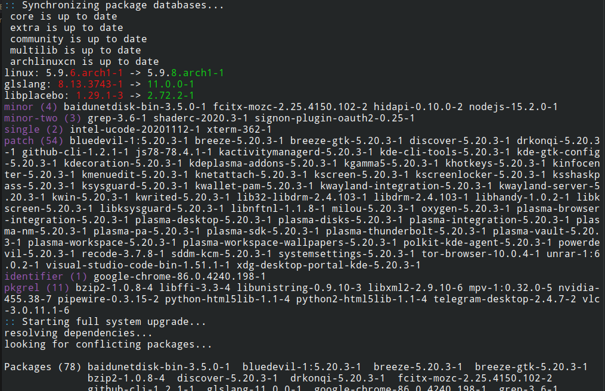

# pacwatch

**pacwatch** is a [pacman](https://www.archlinux.org/pacman/) wrapper which helps you watch important package updates.

[](https://aur.archlinux.org/packages/pacwatch/)



## Installation

```sh
yay -S pacwatch
```

## Usage

Simply run `python pacwatch.py`, or `pacwatch` if you have installed it via AUR.

### Arguments

-   `-h, --help`: how this help message and exit
-   `--reset`: reset settings to default
-   `-e, --edit`: edit the settings in `$EDITOR`
-   `-v, --version`: show program's version number and exit

## Settings

The settings are stored in `~/.config/pacwatch/settings.yml`.

The structure is:

```yml
pacman_command: sudo pacman # for example, you can use "yay" instead
groups: # groups of package version changes, the output will be in the same order
  - epoch
  - major
  - major-two
  - minor
  - minor-two
  - single
  - patch
  - identifier
  - pkgrel
rules: # rules to determine the group of a package change, choose the first matching rule
  - regex: (?:(\d+):)?(\d+)\.(\d+)\.(\d+)(.*)-(\d+) # each capture group of the regex is a part of the version
    parts: # the group of each part
      - epoch
      - major
      - minor
      - patch
      - identifier
      - pkgrel
  - regex: (?:(\d+):)?(\d+)\.(\d+)(.*)-(\d+)
    parts:
      - epoch
      - major-two
      - minor-two
      - identifier
      - pkgrel
  - regex: (?:(\d+):)?(\d+)-(\d+)
    parts:
      - epoch
      - single
      - pkgrel
verbose: # highlight some version changes at top, one package per line with the version change
  groups: # highlight all packages of certain groups
    - epoch
    - major
    - major-two
  extra: # extra verbose output for certain packages
    - regex: linux(-(lts|zen|hardened))? # the packages which match this regex use this rule
      always: true # always use verbose output for these packages
    - packages: # the packages in this array use this rule
        - systemd
      groups: # if the changes of the packages are in these groups, use verbose output
        - minor-two
  ignore: # ignore verbose output for certain packages
    - regex: lib.+
      always: true
```
